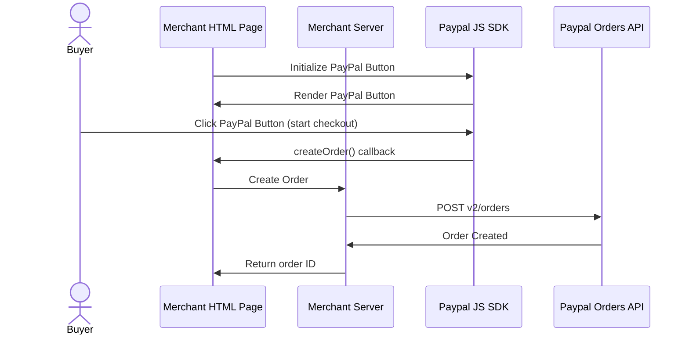

# Upgrading your Client-side integration to a Server-side integration

We recommend using a combination of client-side and server-side code to integrate the PayPal Buttons on your e-commerce website. If you currently have client-side only PayPal Buttons integration, this page will describe how to update your integration to the recommended approach.
<br/><br/>

> **Know before you code**
>
> [How to Setup a Developer Account](https://www.youtube.com/watch?v=O_9G722SpXQ&t=72s) <br/><br/>

# What do I need to change?

If you are reading this page, we expect that you already have a client-side PayPal Button integration in place. That said, several steps are required to get you up and running with the recommended approach.

Specifically:

1. Setup a server-side integration with the [PayPal REST API's](https://developer.paypal.com/api/rest/).

1. `createOrder` JavaScript callback must be changed to use your server-side to create and return an Order ID using the PayPal REST API's.

1. `onApprove` JavaScript callback must be changed to use your server-side to complete transactions using the PayPal REST API's.

<br/><br/>

# 1. Setup a server-side integration with the PayPal REST API's

PayPal REST API's follow a common integration approach used by other RESTful API's out there in the world. For PayPal, you will minimally need to do the following:

1. Setup a PayPal developer account if you have not already.

1. Create a PayPal REST application and obtain a client + secret

1. Use the client + secret combination to obtain an OAuth access token

1. Use the OAuth access token to directly make REST calls to the PayPal Order API's -- which you will need for this document.

<br/><br/>

# 2. Change your `createOrder()` callback

Your current integration may likely be using the client-side order create functions. You will need to replace this code to call your server instead. Before-and-after examples are below.

## Current state of client-side integration behavior

With the client-side integration pattern, the SDK code would take care of calling the v2 Orders API on your behalf. It would also handle the authorization for you.

```js
createOrder(data, actions) {
  return actions.order.create({
    purchase_units: [
      {
          amount: {
            value: "88.44",
          },
      }],
  });
}
```

### Changes needed to migrate to using server-side integration pattern

To simplify the integration of your e-commerce website with the PayPal v2 Orders API, you can move the order creation process to your server-side. The following steps are required to create an order on the server-side:

1. Obtain an access token to use for PayPal backend API calls. This [video tutorial](https://www.youtube.com/watch?v=HOkkbGSxmp4&t=113s) can walk you through the steps.
2. Pass necessary checkout info from the browser client to your server-side API endpoint.
3. Call the PayPal Orders API from your server-side code and return the order ID in your createOrder() callback.

## New state of client + server integration behavior

```js
createOrder: function (data, actions) {
  return (
      // send your cart info to your server side to create a PayPal Order.
      fetch("/your-server/api/create-paypal-order", {
          method: "POST",
          body: JSON.stringify({
          // BELOW IS EXAMPLE DATA FOR DEMONSTRATION ONLY
            cart: [
              {
                sku: "YOUR_PRODUCT_STOCK_KEEPING_UNIT",
                quantity: "YOUR_PRODUCT_QUANTITY",
              }],
            }),
        })
        .then((response) => response.json())
        // return the PayPal Order ID that you received from the PayPal backend
        .then((order) => order.id)
      );
}
```

**The following diagram shows the process of creating an order:**



<br/><br/>

# 3. Change your `onApprove()` callback

## Current state of client-side integration behavior

```js
onApprove(data, actions) {
    return actions.order.capture()
        .then(function (orderData) {
          // Successful capture!
        })
        .catch(function (err) {
          // Failed capture
    });
}
```

### We pass the OrderID for you to the helper

On the client-side, the SDK provides an actions.orders.capture() helper for capturing the order, which takes care of passing the Order ID to the v2 Orders API capture endpoint and handling the authorization.

### We automatically restart the flow for INSTRUMENT_DECLINED errors

#### Changes needed to migrate to using server-side integration pattern

1. Pass the order ID to your server.

2. Update your client-side code to call actions.restart() when there's an INSTRUMENT_DECLINED error.

use code snippet from our [demo page]: (https://developer.paypal.com/demo/checkout/#/pattern/server)

## New state of client + server integration behavior

```js
onApprove: function (data, actions) {
    // Pass the PayPal Order ID to your server side where you will capture it
    return fetch("/my-server/patch-paypal-order", {
        method: "POST",
        body: JSON.stringify({
          orderID: data.orderID
        })
      })
      .then((response) => response.json())
      .then(function (orderData) {
          // Three cases to handle:
          //   (1) Recoverable INSTRUMENT_DECLINED -> call actions.restart()
          //   (2) Other non-recoverable errors -> Show a failure message
          //   (3) Successful transaction -> Show confirmation or thank you

          // This example reads a v2/checkout/orders capture response, propagated from the server
          // You could use a different API or structure for your 'orderData'
          const errorDetail = Array.isArray(orderData.details) && orderData.details[0];

          // Recoverable state, per:
          // https://developer.paypal.com/docs/checkout/integration-features/funding-failure/
          if (errorDetail && errorDetail.issue === 'INSTRUMENT_DECLINED') {
              return actions.restart();
          }

          if (errorDetail) {
              console.error('Sorry, your transaction could not be processed.', errorDetail);
          }

          // Successful capture! For demo purposes:
          console.log('Capture result', orderData, JSON.stringify(orderData, null, 2));
      })
      .catch(function (err) {
          // Failed capture
      });
}
```

## Benefits of using a Server-side Integration

- Secure Authorization with PayPal's API: Use a CLIENT_ID and CLIENT_SECRET to securely consume PayPal's API from your server-side code. The CLIENT_SECRET is only known by your server-side code and uniquely identifies your application.
- Secure Order Creation: Keep sensitive data, such as order amount, on the server to prevent tampering by outside actors.

## Best Practices for JS SDK Server-Side Integrations:

1. CLIENT_SECRET should never be checked into git. We recommend passing this sensitive value to the web server at runtime as an environment variable. It's common to use a .env file that is ignored by git to load sensitive values like this secret.

To securely store your credentials in your application code, we recommend using a .env file. You can find the relevant libraries for Node.js, PHP, and Python at the following links:

- Node.js: https://github.com/motdotla/dotenv
- PHP: https://github.com/vlucas/phpdotenv
- Python: https://github.com/theskumar/python-dotenv

2. The client credentials auth token returned by `/v1/oauth2/token` api endpoint should never be passed to the browser. Keep this value in memory on the server-side and use it as the Authorization header for all other api calls.  
   Here's an example API call in Node.js that uses the client credentials auth token as the Authorization header for all other API calls:

```
const encodedClientCredentials = Buffer.from(`${client}:${secret}`).toString("base64");

const response = await fetch(`${apiBaseUrl}/v1/oauth2/token`, {
    method: "POST",
    body: "grant_type=client_credentials",
    headers: {
      Accept: "application/json",
      "Content-Type": "application/x-www-form-urlencoded",
      "Accept-Language": "en_US",
      Authorization: `Basic ${encodedClientCredentials}`,
    });

const data = await response.json();

// do not expose "data.access_token" to the browser
```

3. Create API endpoints to wrap the PayPal API. These API endpoints should include error handling.

- for errors, include the response body in the API's error response to provide helpful information about the error. For example, when capturing an order, an 'INSTRUMENT_DECLINED' error might be returned in the response body.
- for errors, include the HTTP status code in the API's error response to provide value for troubleshooting purposes. For example, 4xx errors might indicate bad user input, while 5xx errors might indicate internal failures.

# Frequently Asked Questions:

- What is server-side code?

  Server-side code runs securely on a web server and is typically used to communicate with API and Databases. Common server-side languages used to make websites include Node.js, PHP, ASP.NET, Ruby, and Java.

- What should I do if I do not have the ability to run server-side code?

  We recommend using one of PayPal's partners to host your website like Wix, GoDaddy, Shopify, and BigCommerce.
